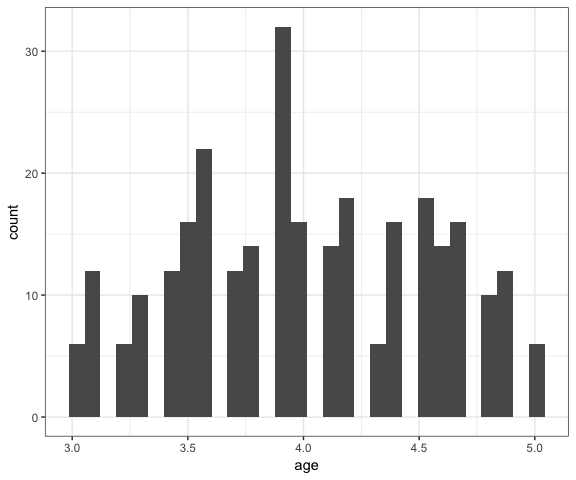
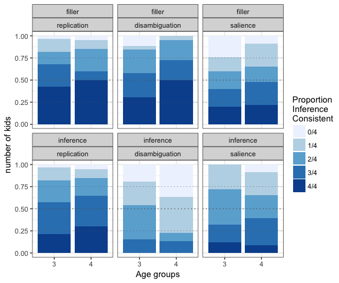

info\_kid\_ses
================
Sebastian Sauer
4 11 2016

My take on the kids' info challenge, building on @tjmahrs idea. See here: <https://twitter.com/annemscheel/status/794578875615498240>

Original
========

``` r
# run data prep script
source("./analysis/info_e4_ana.R")
```

``` r
library(tidyverse)
```

I was thinking whether the variable `correct` really is metric; if not, a count data analysis seems more appropriate. Even if it is not metric, it appears we are counting the number of correct responses (I haven't read the paper), so count analysis may still be appropriate.

At any rate, I like @tjmahrs grey-formatting, and followed this approach.

First, let's get to know to the data a little more.

``` r
mss %>% 
  qplot(x = age, data = .)
```



``` r

n_distinct(mss$age)
## [1] 21
```

Let's bin age to half-year groups.

``` r
# mss$age_bins <- cut(mss$age, breaks = c(2.99, 3.5, 4, 4.5, 5.01))
mss$age_bins <- cut(mss$age, breaks = c(2.99, 4, 5.01))

n_distinct(mss$age_bins)
## [1] 2
```

Now count the categories of `correct` per half-year age group, experiment, and trial type.

``` r
mss %>% 
  select(trial.type, expt, correct, age_bins) %>% 
  count(trial.type, expt, correct, age_bins) -> mss_count
```

Now plot the counts.

``` r

 
ggplot(mss_count) +
  aes(x = age_bins, y = n, fill = factor(correct)) +
  geom_bar(position = "fill", stat = "identity") +
  facet_wrap(trial.type~expt) +
  scale_y_continuous("number of kids") +
  scale_fill_brewer(labels = c("0/4", "1/4", "2/4", "3/4", "4/4"),
                    name = "Proportion \nInference \nConsistent") +
  scale_x_discrete("Age groups", labels = c(3,4)) +
  geom_hline(yintercept = .5, linetype = "dotted", size = .5, color = "grey40") +
  geom_hline(yintercept = .25, linetype = "dotted", size = .25, color = "grey40") +
  geom_hline(yintercept = .75, linetype = "dotted", size = .25, color = "grey40")
```


